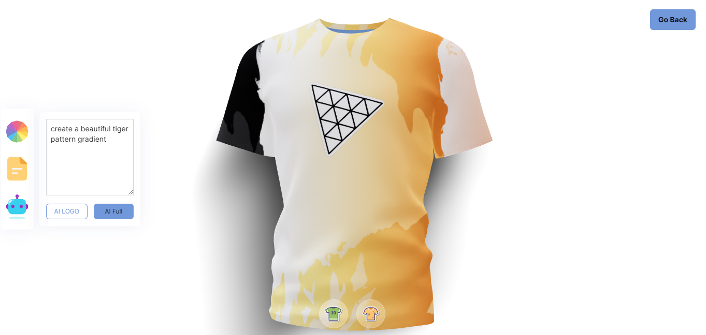

A 3D Clothing Design Website with OpenAi plugin integration. Valtio was used for state management, react 3 fiber and drei was used for the 3D IMAGE. Framer Motion for the animation. 

The website takes in an input design and also fetches a logo design to use as a mockup on the shirt.
